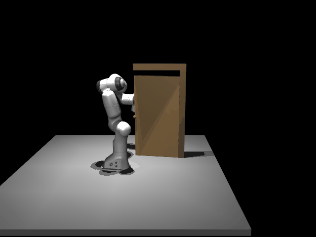
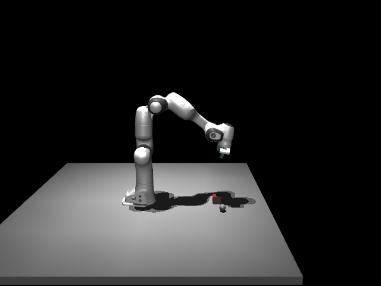
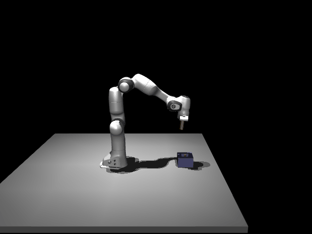
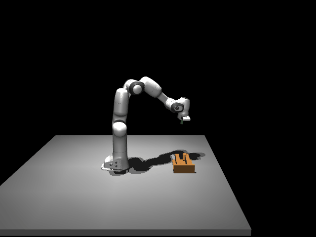
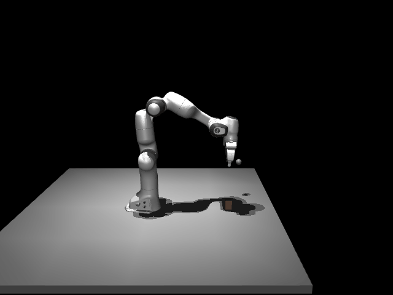
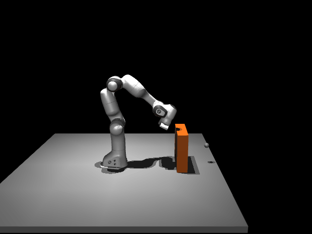

# Language-Model-Guided Robot Skill-Program Synthesis

This repository accompanies the paper **Reducing Expert Effort in Task-Specific Robot Motion Skill Design through Language-Model-Guided Synthesis**. It provides the standalone runtime and public command-line tools for inspecting and reproducing the reported simulation study, together with curated records, replay assets, and featured trajectory demonstrations.

The study uses a Franka Emika Panda with a parallel gripper in MuJoCo. The six tasks are door pushing, planar pushing to a goal, peg insertion, peg traversal through a channel, grasp-and-place, and obstacle reaching.

> **Archive status.** The executable runtime, catalog, paper cross-reference, and featured demonstrations are included. Commands that require a catalog fail clearly rather than silently substituting an unrecorded result.

## Reproducibility tiers

The archive separates three purposes:

1. **Exact paper reanalysis** reads immutable, catalogued records and regenerates summaries without calling an LLM or rerunning physics. Use `scripts/reproduce_paper_results.py`.
2. **Executable replay** runs an archived skill, parameter map, and frozen scene configuration, or renders one catalogued record. It is deterministic given the archived inputs and simulator.
3. **Stochastic protocol replication** reruns CMA-ES or structural refinement. Results can differ because optimization seeds, simulator versions, and LLM responses affect the trajectory. LLM replication is not a claim of bit-for-bit reproduction.

## Install

From a fresh checkout:

```bash
conda env create -f environment.yml
conda activate robot-skill-synthesis
python -m pip install -e .
```

For headless rendering on Linux, the environment sets MuJoCo to use an off-screen backend. If your system needs an explicit choice, run `export MUJOCO_GL=osmesa` before rendering. See [`docs/INSTALLATION.md`](docs/INSTALLATION.md) for package checks and platform notes.

## Quick start

All commands below are run from this repository root. Add `--dry-run` before a costly command to inspect inputs, output paths, and the intended protocol where supported.

### 1. Validate the archive

```bash
python scripts/validate_archive.py --root .
```

For complete cardinality checks, run:

```bash
python scripts/validate_archive.py --root . --strict \
  --expected-primary 900 --expected-semantic 420 --expected-total 1380
```

### 2. Reanalyse paper records

```bash
python scripts/reproduce_paper_results.py \
  --data-root data --out-dir reproduced_results --strict
```

This writes `reproduced_results/paper_summary.json`. It does not contact an API or run a simulation.

### 3. Optimize continuous parameters with CMA-ES

The source can be an LLM-created, expert-reference, scaffold, grammar-random, or explicit skill record:

```bash
python scripts/run_parameter_optimization.py \
  --source expert_reference --task obstacle_reach --seed 0 \
  --cma-budget 200 --basins 3 --episodes 3 \
  --out-dir runs/parameter_optimization
```

Use `--paper-protocol` to select the reported budget (`B=200` requested, three basins, and three episodes). Use `--backend mock` for a quick software-only smoke test; mock results are not scientific evidence.

### 4. Run structural refinement

A small local run using the scaffold initialization and Bandit refinement is:

```bash
python scripts/run_structural_search.py \
  --method bandit --initialization scaffold \
  --task obstacle_reach --seed 0 --iterations 1 \
  --cma-budget 8 --episodes 1 --out-dir runs/structural_search
```

The paper contract is available explicitly:

```bash
python scripts/run_structural_search.py \
  --method bandit --paper-protocol --out-dir runs/paper_protocol
```

The contract covers six tasks, seeds 0--9, 15 refinement attempts, requested CMA budget 200, 198 allocated candidate evaluations (66 per each of three scene configurations), and three episodes per objective. Early stopping can reduce actual consumption. LLM refinement additionally requires API setup below.

### 5. Render a skill

A catalogued record can be rendered directly:

```bash
python scripts/render_skill.py \
  --record-id <record-id> --output renders/example.gif
```

For an explicit replay, provide the task, skill YAML, parameter JSON, and frozen scene-bank JSON:

```bash
python scripts/render_skill.py \
  --task obstacle_reach \
  --skill data/skills/obstacle_reach/example.yaml \
  --parameters data/parameters/obstacle_reach/example.json \
  --scene-bank data/scenes/obstacle_reach/example.json \
  --scene-index 0 --output renders/obstacle_reach.mp4
```

GIF defaults are 640×480 at 15 fps and are capped at 10 MiB. Use MP4 for longer or higher-resolution trajectories.

## Optional LLM setup

LLM calls are opt-in and authenticated only through the process environment. Never put a token in a tracked file, command line, notebook, prompt, output log, or issue. Copy [`.env.example`](.env.example) only as a local reminder and load secrets through your shell or a secret manager.

```bash
read -r -s DEEPSEEK_API_KEY
export DEEPSEEK_API_KEY
```

The paper protocol uses the documented DeepSeek endpoint and model preset. Do not commit the key. To run a methodological variant against an OpenAI-compatible service, set the endpoint and model explicitly, and report those choices with the result:

```bash
read -r OPENAI_COMPATIBLE_BASE_URL
export OPENAI_COMPATIBLE_BASE_URL
read -r OPENAI_COMPATIBLE_MODEL
export OPENAI_COMPATIBLE_MODEL
python scripts/run_structural_search.py --method llm \
  --task obstacle_reach --seed 0 --iterations 1 --cma-budget 8 --episodes 1
```

API calls can incur charges and are not deterministic. `--dry-run` performs no API call. See [`docs/LLM.md`](docs/LLM.md) for privacy, retry, cost, and output guidance.

## Featured demonstrations

The release shows one deterministic winner for each task from the main automatic comparison matrix. Winners are ranked by canonical task score, then composite score, then stable record ID; expert-reference and semantic-study records are excluded. Each trajectory uses the winning skill, tuned parameters, and frozen scene configuration 0.

The gallery below shows the deterministic winners selected from the primary
automatic comparison matrix. Each image is a MuJoCo trajectory rendered with
the archived skill, tuned parameters, and frozen scene configuration 0. The
machine-readable selection rule, hashes, frame counts, and exact commands are
in [`media/demos/manifest.json`](media/demos/manifest.json); the source rows
are in [`data/catalog.csv`](data/catalog.csv).

| Task | Demonstration |
|---|---|
| **Door push**<br>Random-LLMRefine-FixedST · seed 3<br>task score 1.000000 · composite 1.750000<br>`p-random-language-fixed-door_push-seed-03` · [record](data/records/primary/p-random-language-fixed-door_push-seed-03.json) · [`render command`](media/demos/README.md) |  |
| **Push to goal**<br>Random-LLMRefine-FixedST · seed 2<br>task score 0.976306 · composite 0.502737<br>`p-random-language-fixed-push_to_goal-seed-02` · [record](data/records/primary/p-random-language-fixed-push_to_goal-seed-02.json) · [`render command`](media/demos/README.md) |  |
| **Peg insertion**<br>Random-LLMRefine-FixedST · seed 4<br>task score 0.999419 · composite 0.207195<br>`p-random-language-fixed-peg_insert-seed-04` · [record](data/records/primary/p-random-language-fixed-peg_insert-seed-04.json) · [`render command`](media/demos/README.md) |  |
| **Peg channel**<br>Random-LLMRefine-FixedST · seed 5<br>task score 0.989763 · composite 0.604239<br>`p-random-language-fixed-peg_channel-seed-05` · [record](data/records/primary/p-random-language-fixed-peg_channel-seed-05.json) · [`render command`](media/demos/README.md) |  |
| **Grasp and place**<br>Create-LLMRefine-FreeST · seed 6<br>task score 1.000000 · composite 0.658676<br>`p-create-language-free-grasp_place-seed-06` · [record](data/records/primary/p-create-language-free-grasp_place-seed-06.json) · [`render command`](media/demos/README.md) |  |
| **Obstacle reach**<br>Create-LLMRefine-FreeST · seed 7<br>task score 0.997598 · composite 0.697598<br>`p-create-language-free-obstacle_reach-seed-07` · [record](data/records/primary/p-create-language-free-obstacle_reach-seed-07.json) · [`render command`](media/demos/README.md) |  |

## Output and data

Runtime commands write generated files outside the immutable `data/` tree by default. Search runs contain JSON summaries and logs, CMA runs contain `best_parameters.json`, optimization and final metrics, diagnostics, traces, and replay identity, and renders contain MP4 or GIF media. The curated data uses stable record IDs, relative paths, SHA-256 hashes, and task/arm/seed/study fields. Definitions and cross-references are in [`docs/DATA_FORMATS.md`](docs/DATA_FORMATS.md) and [`docs/PAPER_CROSSWALK.md`](docs/PAPER_CROSSWALK.md).

## Hardware and software reference

The original and validation setup was Ubuntu 20.04.6 on an Intel Core i9-10900X with 125 GiB RAM and two NVIDIA RTX 2080 Ti GPUs. The reference Python interpreter was 3.10.19 and MuJoCo was 3.5.0. Physics simulation is CPU-based; GPUs are useful primarily for off-screen rendering and are not required for the numerical protocol. Small mock-backend runs can be performed without MuJoCo rendering.

## Repository map

- [`dsl/`](dsl/README.md): typed skill grammar, validation, and serialization.
- [`compiler/`](compiler/README.md): conversion from a skill program to a controller artifact.
- [`primitives/`](primitives/README.md): motion generators, control, and termination.
- [`simulation/`](simulation/README.md): MuJoCo backend, scene assembly, execution, and rendering.
- [`evaluation/`](evaluation/README.md): episode execution and design metrics.
- [`mutation/`](mutation/README.md): structural mutation operators.
- [`search/`](search/README.md): CMA-ES, structural search, proposal handling, and catalog resolution.
- [`tasks/`](tasks/README.md): task definitions and seed skills.
- [`scripts/`](scripts/README.md): public command-line entry points.
- [`data/`](data/README.md): curated records and paper cross-references; see [`docs/DATA_FORMATS.md`](docs/DATA_FORMATS.md) for the public schema.
- [`docs/`](docs/README.md): installation, protocol, data, and troubleshooting notes.
- [`tests/`](tests/README.md): public runtime regression tests.

## Citation and license

Please cite the paper and the archive using [`CITATION.cff`](CITATION.cff). The original runtime in this archive is released under the MIT License; bundled third-party assets retain their own terms, listed in [`THIRD_PARTY_NOTICES.md`](THIRD_PARTY_NOTICES.md).
